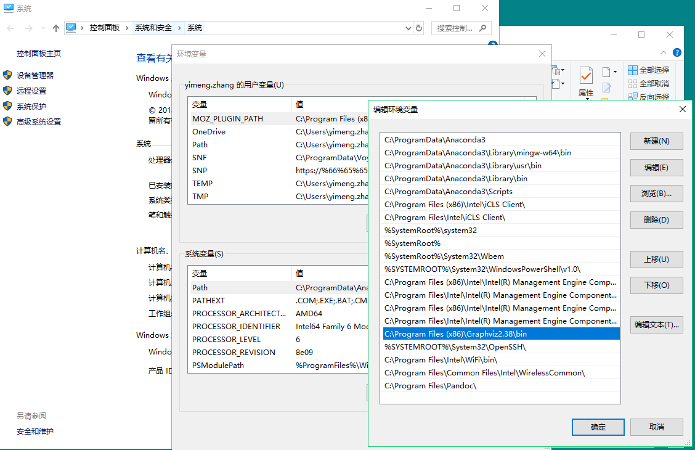
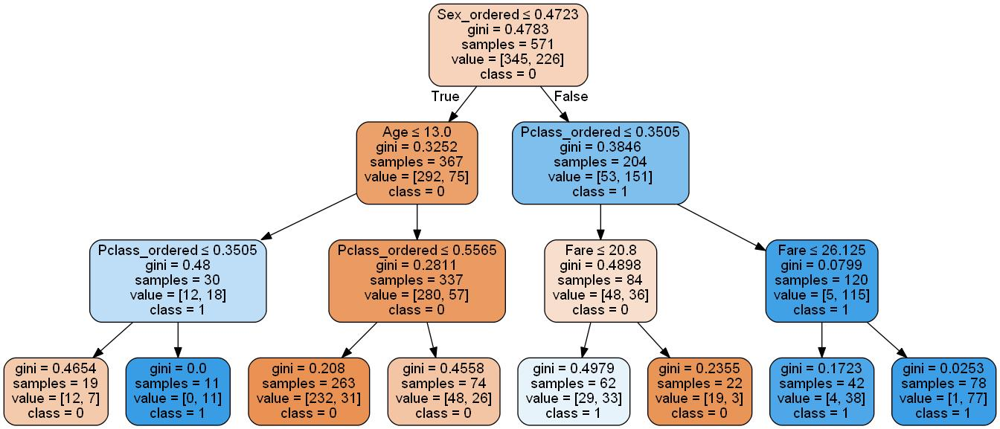

# Rule_Extraction_From_Trees

A toolkit for extracting comprehensible rules and  selecting the best performing rule set from tree-based algorithms, based on  [Skope-rules](https://github.com/scikit-learn-contrib/skope-rules). Currently only supports 2-classes classification task.

**Major groups of functionalities:**

1. Visualize tree structures and output as images;
2. Rule extraction from trained tree models; 
3. Filter rules based on recall/precision threshold on a given dataset;
4. Make predictions by rule voting.

**Model supported:**

1. DecisionTreeClassifier/DecisionTreeRegressor
2. BaggingClassifier/BaggingRegressor
3. RandomForestClassifier/RandomForestRegressor
4. ExtraTreesClassifier/ ExtraTreeRegressor


## Installation

This project requires:

- Python (>= 2.7 or >= 3.3)
- NumPy (>= 1.10.4)
- SciPy (>= 0.17.0)
- Pandas (>= 0.18.1)
- Scikit-Learn (>= 0.17.1)
- pydotplus (>=2.0.2)
- graphviz (>=0.8.2)


**Installing graphviz (for windows user):**

1. Download and install executable from https://graphviz.gitlab.io/_pages/Download/Download_windows.html

2. Set the PATH variable as follows

   

3. Restart your currently running application that requires the path

4. pip install pydotplus


## Quick Start

See **Demo1** [here](https://github.com/Yimeng-Zhang/Rule_Extraction_from_Trees/blob/master/Demo1_Rule_Extraction_from_Trees.ipynb) for a detailed example.

First download the code into your project folder.

1. Train or load a tree-based model. Having the dataset that is trained on is better.

```
import pandas as pd
import numpy as np
from sklearn.model_selection import train_test_split
from sklearn import tree,ensemble,metrics

from rule import Rule
from rule_extraction import rule_extract,draw_tree

# Train the model
model = tree.DecisionTreeClassifier(criterion='gini',max_depth=3)
model.fit(X_train,y_train)
```

2. Extract all the rules from the tree (all paths from root node to leaves)

```python
rules, _ = rule_extract(model=model,feature_names=X_train.columns)
for i in rules:
    print(i)

# output 
Sex_ordered > 0.4722778648138046 and Pclass_ordered > 0.3504907488822937 and Fare > 26.125
Sex_ordered <= 0.4722778648138046 and Age > 13.0 and Pclass_ordered <= 0.5564569681882858
Sex_ordered <= 0.4722778648138046 and Age <= 13.0 and Pclass_ordered <= 0.3504907488822937
Sex_ordered > 0.4722778648138046 and Pclass_ordered <= 0.3504907488822937 and Fare <= 20.800000190734863
Sex_ordered <= 0.4722778648138046 and Age > 13.0 and Pclass_ordered > 0.5564569681882858
Sex_ordered <= 0.4722778648138046 and Age <= 13.0 and Pclass_ordered > 0.3504907488822937
Sex_ordered > 0.4722778648138046 and Pclass_ordered > 0.3504907488822937 and Fare <= 26.125
Sex_ordered > 0.4722778648138046 and Pclass_ordered <= 0.3504907488822937 and Fare > 20.800000190734863

```

3. Draw the structure of the tree

```python
# blue (class=1) denote the node make prediction of class 1
# orange (class=0) denote the node make prediction of class 0
# the darker the color, the more purity the node has 
draw_tree(model=model,
          outdir='./images/DecisionTree/',
          feature_names=X_train.columns,
          proportion=False, # show [proportion] or [number of samples] from a node
          class_names=['0','1'])
```





4. Filter rules base on recall/precision on dataset

```python
rules, rule_dict = rule_extract(model=model_tree_clf,
           		   feature_names=X_train.columns,
                   x_test=X_test,
           	  	   y_test=y_test,
                   recall_min_c0=0.9,  # recall threshold on class 1
                   precision_min_c0=0.6)  # precision threshold on class 1

for i in rule_dict:
    print(i)
# return:(rule, recall on 1-class, prec on 1-class, recall on 0-class, prec on 0-class, nb) 
('Fare > 26.125 and Pclass_ordered > 0.3504907488822937 and Sex_ordered > 0.4722778648138046', (0.328125, 0.9130434782608695, 0.9746835443037974, 0.6416666666666667, 1))
('Fare <= 26.125 and Pclass_ordered > 0.3504907488822937 and Sex_ordered > 0.4722778648138046', (0.21875, 0.875, 0.9746835443037974, 0.6062992125984252, 1))

```


## API Reference

TODO
